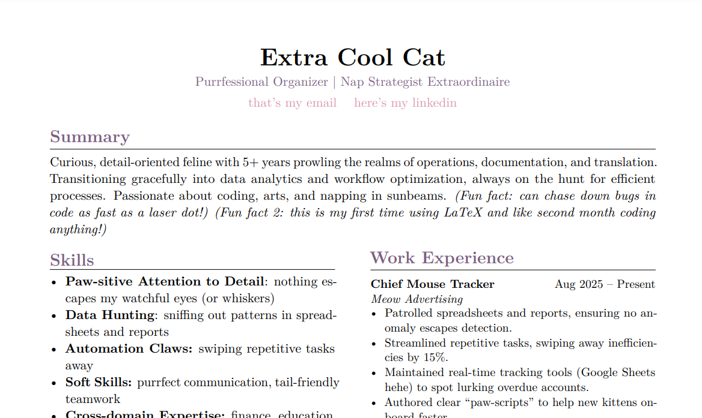

# 🐾 Cat-Inspired Professional Resume (LaTeX)

This project is a fully coded resume created in **LaTeX**, originally based on my real CV but adapted for a highly qualified cat (yes, really, because why not?). 
It’s a blend of:
- Professional ATS-friendly formatting with a touch of personality through colour accents
- Compact and clear sectioning for a lot of information
- Playful wording without losing elegance, easily adaptable to any professional profile

## ✨ Features
- **Clean design** – fits everything on 1 page, but can be extended to 2 pages if needed
- **ATS-friendly** – tested on multiple resume parsers, all content reads perfectly
- **Easily customizable** – change colours, fonts, sections, or layout
- **Fun demo** – demonstrates LaTeX skills while keeping things a little more memorable

## 📂 Files
- `resume.tex` – main LaTeX file
[click here to see it (resume.tex)](resume.tex) 
- `resume.pdf` – compiled example
[click here to see it (resume.pdf)](resume.pdf)  
- `README.md` – you’re reading it :)

## 🚀 Edit on Overleaf
Want to make your own version without installing anything?  
Click below to open this template in **Overleaf** (online LaTeX editor) and edit it directly in your browser (_needs signing in_):  
[https://www.overleaf.com/read/mfcdqrqntgbt#687f55](url) 

## 📜 License
This project is licensed under the **Creative Commons CC BY 4.0** license — feel free to adapt and use it for your own job applications without attribution.  
If you **publish, share, or distribute** this resume as a template or example, please credit the original source :3.

💡 _Why a cat?_  
Because showcasing skills doesn’t have to be boring — and I really love cats.  
This template presents technical LaTeX knowledge in a way that also tells a story and makes the résumé-writing process less soul-crushing.
